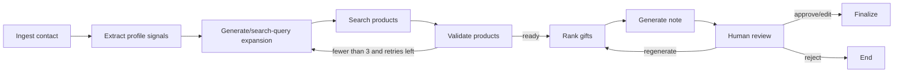

# Architecture

## Goal

Recommend professional gifts from explicit LinkedIn-style evidence while preventing
fabricated products, unsupported personal claims, and awkward or sensitive gifts.

## Workflow

## Components

- `app/api.py`: FastAPI endpoints, review actions, persistence handoff.
- `app/graph.py`: LangGraph wiring and checkpoint boundaries.
- `app/nodes/workflow.py`: extraction, query generation, validation, ranking,
  messaging, metrics, and final output assembly.
- `app/search.py`: Tavily search plus URL, country, price, product-shape, and
  professional-safety validation.
- `app/models.py`: Pydantic request/response contracts, including the nested
  assignment schema.
- `app/static/index.html`: local review dashboard with form input, bulk upload,
  trace display, edit/approve/reject/regenerate controls, and workflow metrics.

## Data and state

The API stores contact rows in `data/contacts.sqlite`. LangGraph checkpoints live in
`data/checkpoints.sqlite`, allowing the graph to pause before human review and resume
after approval, edits, rejection, or regeneration feedback.

## Guardrail strategy

The model extracts only explicit professional evidence. Search queries are expanded
from safe signals, not names or protected traits. Ranking receives only validated
products, and returned URLs must match that validated set. Reasons and generated
messages are scanned again for sensitive/protected-trait references. If the system
cannot validate enough products, it lowers confidence and asks for human input.
